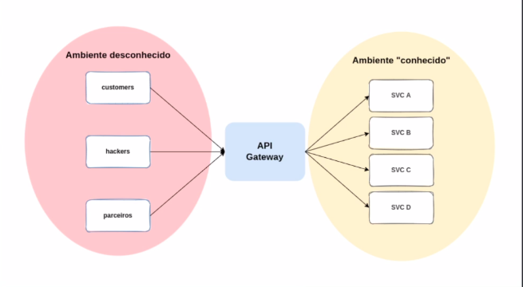
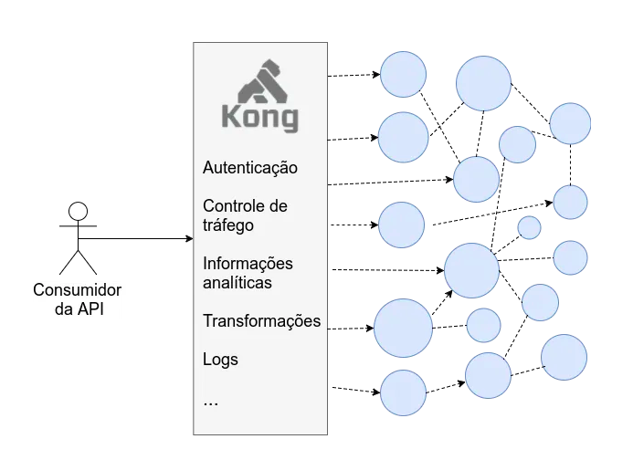
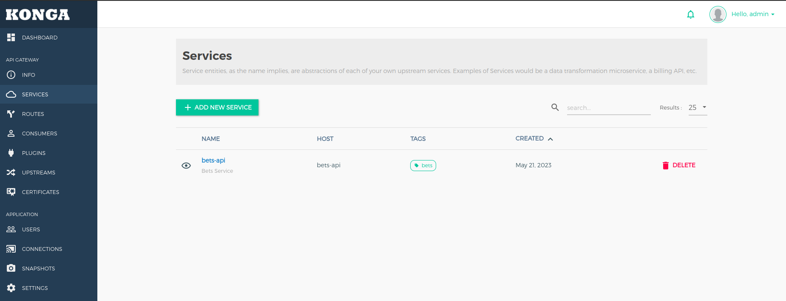

# POC - Kong API Gateway

Este repositório apresenta um estudo sobre API Gateway. Nele é provisionado o ambiente de execução do Kong API 
Gateway utilizando o docker-compose. 

## O que é um API Gateway

É uma ferramenta de gerenciamento, geralmente adicionada entre o cliente e um grupo de sistemas de um determinado contexto, atuando como ponto único de entrada das APIs.



## Funcionalidades de um API Gateway

* Controle de abuso (rate limiting)
* Autenticação / Autorização
* Controle de logs
* Gerenciamento de APIs (routing)
* Métricas padronizadas (ops team)
* Tracing distribuído

## Vantagens e desvantagens de um API Gateway

### Vantagens

* Padronização de algumas features ortgonais (logging, segurança)
* Ajuda na governança de rede da companhia
* Ponto único de entrada na rede - facilita gerenciamento
* Ferramenta essencial para adoção de uma estratégia de APIs

### Desvantagens

* Adiciona alguma complexidade na sua arquitetura
* Precisa de um cuidado extra, devido a disponibilidade (ponto único de falha)
* Ferramenta que precisa de manutenção/atualização

## Kong API Gateway

Kong é um Gateway API escrito em Lua integrado ao Nginx. Por meio de plugins escritos em Lua ele pode customizar o 
proxy do Nginx para, ao encaminhar requisições, prover de forma performática funcionalidades como as descritas na 
figura abaixo.



* Open Source
* Características de micro gateway
* Deployment flexível: pode ser utilizado na camada de borda da rede ou interna para realizar segregação de contextos
* Pronto para kubernetes
* Extensível via plugins

## Konga

Konga é uma interface administrativa (GUI) para o Kong API Gateway. Nela é possível gerenciar os serviços e as rotas, 
bem como, visualização de métricas, controle de usuários, etc.



## Tecnologias utilizadas

* Docker
* Docker-compose
* Kong Api Gateway
* Konga UI 
* Keycloak
* Postgres

## Rodando

Na pasta raiz do projeto voce pode executar

```shell
docker-compose up -d
```

## Exemplo de configurações de serviços e rotas no Kong
```curl
# Configuração do serviço de apostas no Kong
{
    "next": null,
    "data": [
        {
            "path": null,
            "protocol": "http",
            "retries": 5,
            "id": "76461bc4-41c0-4688-bfec-d29ad70a49fe",
            "name": "bets-api",
            "write_timeout": 2000,
            "tags": [
                "bets"
            ],
            "ca_certificates": null,
            "created_at": 1684702368,
            "updated_at": 1684962759,
            "tls_verify_depth": null,
            "connect_timeout": 2000,
            "read_timeout": 2000,
            "client_certificate": null,
            "host": "bets-api", # srv encontrado no docker-compose
            "enabled": true,
            "tls_verify": null,
            "port": 9999 # port encontrado no docker-compose
        }
    ]
}
```

```json
# Configuração da rota de criar apostas no Kong 
{
    "next": null,
    "data": [
        {
            "service": {
                "id": "76461bc4-41c0-4688-bfec-d29ad70a49fe"
            },
            "protocols": [
                "http",
                "https"
            ],
            "id": "18ff749e-6f6c-48a7-b81c-1d9d7f35206d",
            "paths": [
                "/api/bets"
            ],
            "request_buffering": true,
            "response_buffering": true,
            "destinations": null,
            "tags": [
                "bets"
            ],
            "https_redirect_status_code": 426,
            "regex_priority": 0,
            "created_at": 1684702771,
            "updated_at": 1684963029,
            "hosts": [
                "bets.app" # enviado no header da requisição para roteamento
            ],
            "path_handling": "v1",
            "preserve_host": false,
            "sources": null,
            "snis": null,
            "name": "bets-create",
            "headers": null,
            "strip_path": false,
            "methods": [
                "POST"
            ]
        }
    ]
}
```

```json
# Chamada à rota de criação de aposta configurada no Kong (observar o header Host)

curl --location --request POST 'http://localhost:8000/api/bets' \
--header 'Host: bets.app' \
--header 'Content-Type: application/json' \
--data-raw '{
    "match": "1X-DC",
    "email": "john@doe.com",
    "homeTeamScore": "2",
    "awayTeamScore": "3",
    "championship": "Uefa Champions League"
}'
```
